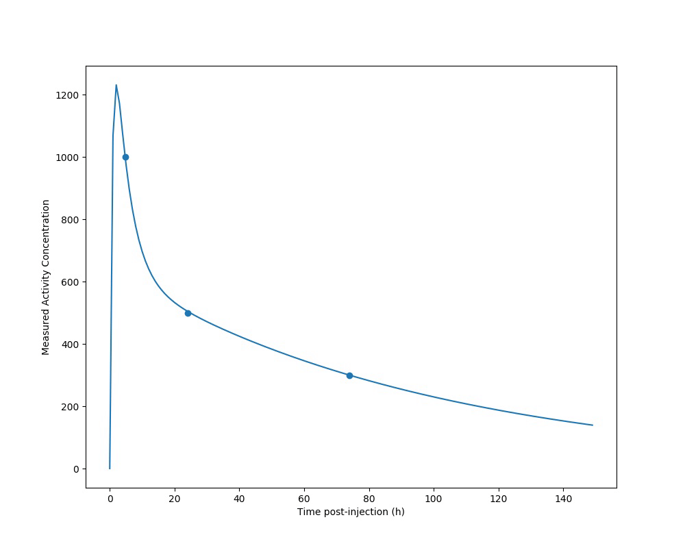

# TriExponential-Solver
Analytical Algorithm for Computing 3-timepoint Nuclear Medicine Time Activity Curves

Pharmacokinetics backend of the VRAK Voxel dosimetry software reported in Med Phys. 2013 Nov;40(11):112503. doi: 10.1118/1.4824318.
https://www.ncbi.nlm.nih.gov/pubmed/24320462

Curves are solved analytically to pass through measurements via linear fit of log-transformed data. Each phase depletes to very near zero as it approaches subsequent measurements. The ideal case with a combination of slow fast washout components is illustrated above with separate exponential phases denoted. Priority is given to the final measurement as this is considered most important for accurately approximating the time integral with long half-life therapeutic isotopes. Some error handling conditions are applied to reasonably fit a curve through early time points which don't obey common physiological patterns, for example in instances of misalignment between voxels in serial imaging. The method accepts three post-treatment imaging timepoints and employs the convention to decay correct measurements before performing pharmacokinetics processing. The method has been developed for Lu-177 therapies. Isotopes with significantly shortef physical half lives may require different assumptions for uptake rate parameters.

